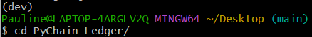
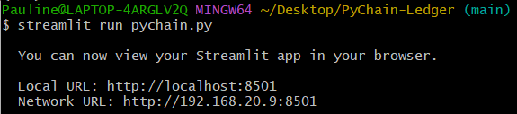
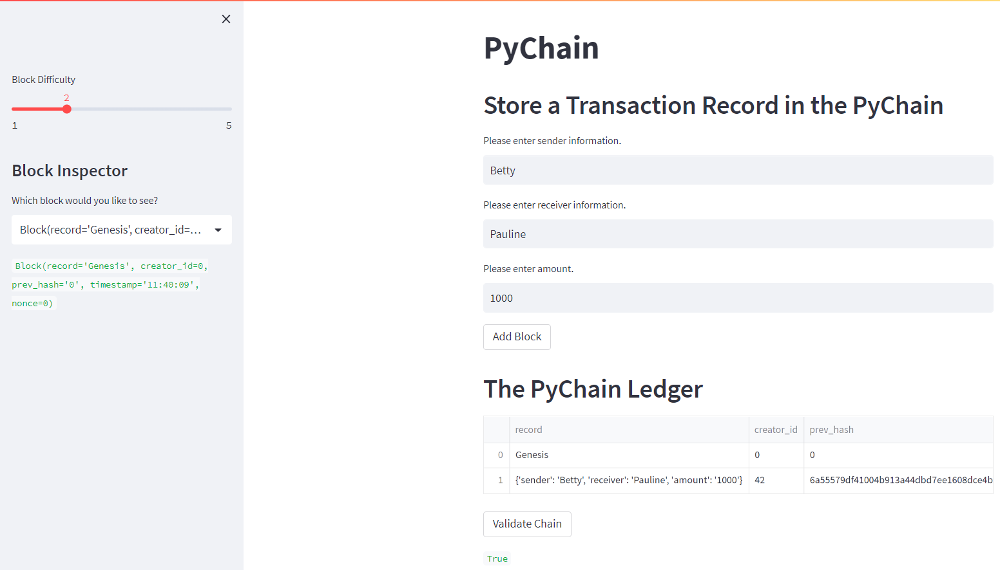
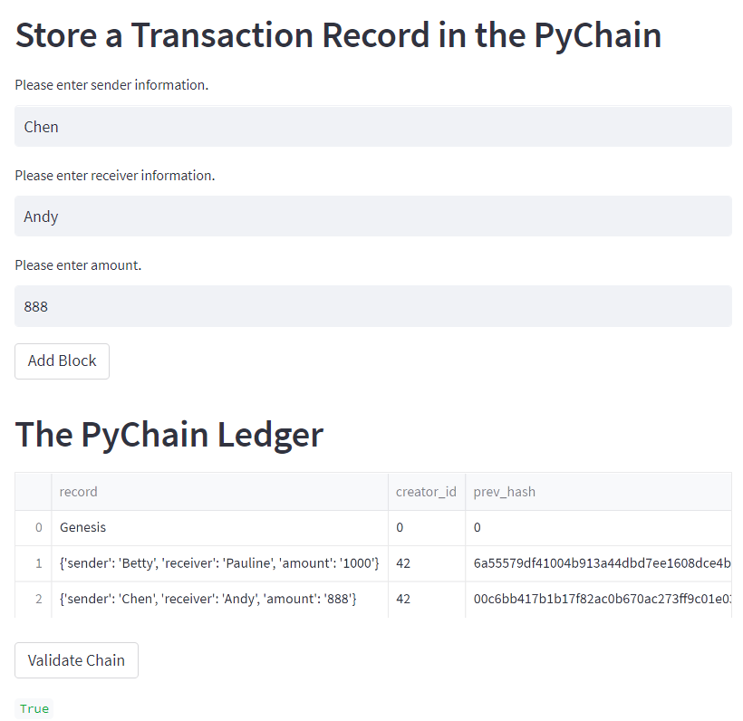
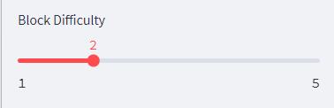
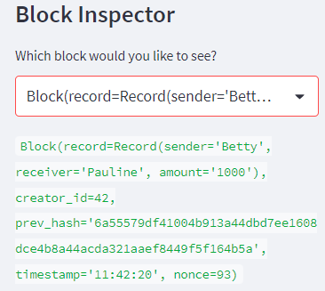

# PyChain-Ledger

## Background
I am a fintech engineer who’s working at one of the five largest banks in the world. I was recently promoted to act as the lead developer on their decentralized finance team. My task is to build a blockchain-based ledger system, complete with a user-friendly web interface. This ledger should allow partner banks to conduct financial transactions (that is, to transfer money between senders and receivers) and to verify the integrity of the data in the ledger.

## Environment Set Up
In order to run the user-friendly web interface successfully, it is recommended to install the streamlit library in a seperate environment. The users should open a terminal instance, and activate their Conda development environment.

Then the users need to install the streamlit library by running the following command in the terminal:

`pip install streamlit`

Then the users can confirm the installation by running the following command:

`conda list streamlit`

## Running the Streamlit Application
First, the users need to go into the folder which contains the python file `pychain.py`.

Then the users can run the Streamlit application by using the `streamlit run pychain.py` command in the terminal. The messages similar to the ones in the screenshot should be shown:

The users now should be able to use the Streamlit web application.

## Using Streamlit Application
The users should enter the `sender`, `receiver` and the `amount` of each of the transaction. Then the users will press the button `add block` to add a new block of record to the blockchain-based ledger system.

Then they can press the `Validate Chain` button to validate if the new block is the real record. It it is a real record, the users will receive a feedback saying `True`. 

Next, the users can add another block to the ledger by repeating the first step above, they can also validate the record as the second step above.

In addition, the users can also change the block difficulties by dragging the slider on the left hand side.

If the users would like to inspect one particular block in detail, they can use the drop-down menu on the left hand side to do so.

